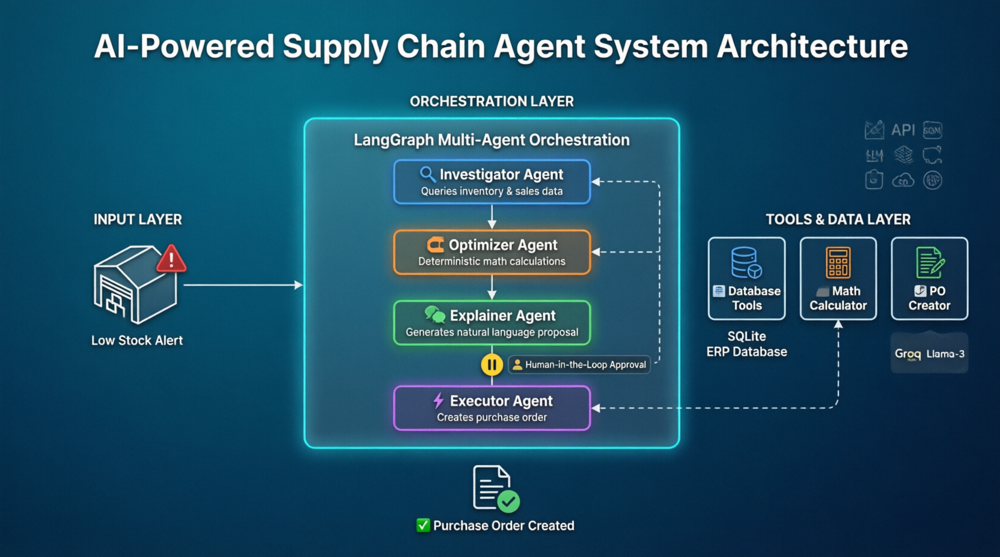

# 🤖 Agentic Supply Chain Control Tower

An enterprise-grade, event-driven multi-agent AI system for autonomous supply chain decision-making with human governance.

## 🎯 Overview

This project demonstrates a production-ready AI architecture that:

- Monitors inventory in real-time via Apache Kafka
- Uses multi-agent LangGraph workflows for decision-making
- Implements Human-in-the-Loop governance for high-value decisions
- Provides a conversational AI assistant (Text-to-SQL)
- Offers full observability with LangSmith

## ✨ Features

### 🤖 Multi-Agent Workflow

- **Investigator Agent**: Gathers inventory data and contract context via RAG
- **Optimizer Agent**: Calculates optimal reorder quantities (deterministic math)
- **Explainer Agent**: Generates natural language proposals
- **Executor Agent**: Creates purchase orders after approval

### 💬 AI Chat Assistant

- Natural language queries to SQLite database
- Dynamic schema discovery
- Persistent conversation memory
- Formatted responses with react-markdown

### 🎛️ Human-in-the-Loop

- Action Queue for pending approvals
- Glass Box UI showing math, context, and AI proposal
- Approve/Reject workflow with audit trail

## 🌟 Summary

- **Multi-Agent Orchestration**: LangGraph workflow with Investigator, Optimizer, Explainer, and Executor agents
- **Real-Time Event Streaming**: Apache Kafka triggers autonomous agent workflows
- **Context-Aware RAG**: Qdrant vector database for supplier contracts and SLAs
- **Deterministic Math**: Python tools prevent LLM hallucinations in financial calculations
- **Human-in-the-Loop**: LangGraph interrupts ensure governance before execution
- **Production Observability**: LangSmith tracing for full transparency

## 🏗️ Architecture



## 🚀 Quick Start

```bash
# 1. Start infrastructure (Kafka, Qdrant)
docker compose up -d

# 2. Install dependencies
pip install -r requirements.txt

# 3. Seed mock data
python src/seed_data.py
python src/generate_mock_pdfs.py
python src/tools/rag_setup.py

# 4. Run the agent
python -m src.main
```

## 🚀 Getting Started

### Prerequisites

- Python 3.12+
- Node.js 18+
- Apache Kafka (Docker)
- Groq API key

# Terminal 1: Kafka (Docker)

docker-compose up -d

# Terminal 2: FastAPI

uvicorn api.main:app --reload --port 8001

# Terminal 3: Kafka Consumer

python src/events/consumer.py

# Terminal 4: Trigger an event

python src/events/producer.py

### Tech Stack

AI/ML: LangGraph, LangChain, LlamaIndex, Groq (Llama 3.3), Qdrant
Backend: Python, FastAPI, Apache Kafka, SQLite
Frontend: Next.js 14, TypeScript, Tailwind CSS, shadcn/ui
Observability: LangSmith
